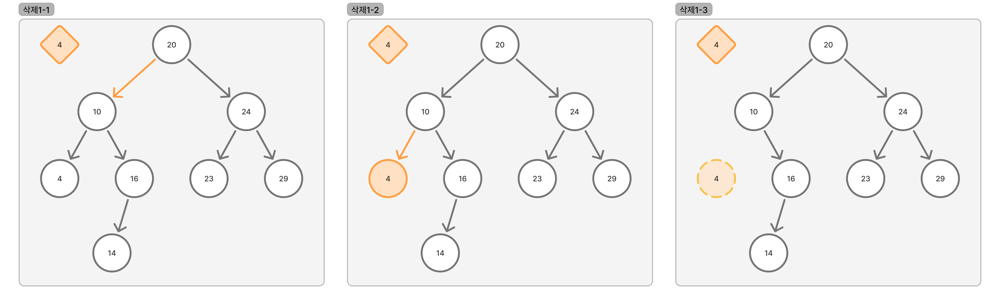

# 배열

---

# 1. 이론 학습

## 구조
- 노드와 링크로 구성된 자료구조
- 그래프의 일종이며, Cycle이 없음
- 계층적 구조를 나타낼 때 많이 사용
  - 폴더 구조
  - 조직도, 가계도

## 용어 정리
- **노드(Node):** 트리 구조의 자료 값을 담고 있는 단위
- **엣지(Edge):** 노드 간의 연결선, 링크 또는 브랜치
- **루트 노드(Root):** 부모가 없는 노드, 가장 위의 노드
- **잎새 노드(Leaf):** 자식이 없는 노드, 단말 노드
- **내부 노드(Internal):** 잎새 노드를 제외한 모든 노드
- **부모(Parent):** 연결된 두 노드 중 상위의 노드
- **자식(Child):** 연결된 두 노드 중 하위의 노드
- **형제(Sibling):** 부모를 공유하는 노드
- **깊이(Depth):** 루트에서 어떤 노드까지의 간선의 수
- **레벨(Level):** 트리의 특정 깊이를 가지는 노드 집합
- **높이(Height):** 트리에서 가장 큰 레벨 값
- **크기(Size):** 자신을 포함한 자식 노드의 개수
- **차수(Degree):** 각 노드가 가진 가지의 수
- **트리의 차수(Degree of Tree):** 트리에서 가장 큰 차수를 가진 노드의 차수

## 특징
- 다른 노드로 이동하는 경로는 유일함
- 노드가 N개인 엣지의 개수는 N-1개
- 모든 노드는 연결되어 있음
- 하나의 Edge를 끊으면 2개의 Sub-Tree로 분리됨 (재귀적)

# 2. 이진트리 (Binary Tree)

- 각 노드는 최대 2개의 자식을 가질 수 있음
  - 자식은 좌/우로 구분됨

## 1) 이진트리의 종류

### 포화 이진 트리 (Perfect Binary Tree)

- 모든 노드가 2개의 자식을 가짐
  - 배열로 표현하기 좋음 (모든 노드가 가득 차있기 때문)
- 모든 잎새 노드가 같은 깊이에 있음
### 완전 이진 트리 (Complete Binary Tree)

- 마지막 레벨을 제외한 모든 레벨이 꽉 차 있음
- 마지막 레벨은 왼쪽부터 채워짐 
### 정 이진 트리 (Full Binary Tree)

- 모든 노드가 0개 또는 2개의 자식을 가짐
### 편향 트리 (Skewed Tree, 사향 트리)

- 모든 노드가 한쪽 방향으로만 자식 노드를 가짐
- 왼쪽 편향 트리, 오른쪽 편향 트리로 구분됨
- 연결 리스트의 구조
### 균형 이진 트리 (Balanced Binary Tree)

- 모든 노드의 서브 트리 높이 차이가 1 이하인 트리
  - 탐색 속도를 높이기 위해 균형을 맞춤
- AVL 트리, 레드-블랙 트리 등이 있음

## 2) 이진트리의 특징
- 포화 이진트리의 높이가 h일때, 노드의 수는 2^(h+1) - 1
- 포화(or 완전) 이진 트리의 노드가 N개 일 때, 높이는 logN의 정수부
- 이진 트리의 노드가 N개 일 때, 최대 가능 높이는 N-1 (편향 트리)

## 3) 이진트리의 순회(Traversal)
- 모든 노드를 빠트리거나 중복하지 않고 방문하는 연산
- 전위 순회(PreOrder, VLR), 중위 순회(InOrder, LVR), 후위 순회(PostOrder, LRV) => `DFS (Depth First Search)`
- 레벨 순회 => `BFS (Breadth First Search)`

---

# 3. 이진 탐색 트리 (Binary Search Tree)

## 1) 규칙
- 왼쪽 자식 노드의 키는 부모 노드의 키보다 작음
- 오른쪽 자식 노드의 키는 부모 노드의 키보다 큼
- 각각의 서브 트리도 이진 탐색 트리를 유지
- 중복된 키를 허용하지 않음

## 2) 특징
- 규칙에 의해 데이터가 정렬됨
- 이진 트리에 비해 탐색이 빠름 (균형 유지 필요)
  - 균형 상태: O(logN)
  - 불균형 상태: O(N) (편향 트리와 동일한 상태)

## 3) 이진 탐색 트리의 키 탐색
1. 루트 노드에서 시작
2. 대소 비교하여 찾는 데이터가 작으면 왼쪽, 크면 오른쪽으로 이동
3. 찾는 데이터가 없으면 null을 반환
4. 어떤 데이터를 찾더라도 최대 트리 높이만큼의 탐색이 이루어짐

## 4) 데이터 삽입
1. 위치 탐색
2. 삽입: 리프 노드에 도달하면 작으면 왼쪽, 크면 오른쪽 자식자리에 삽입
3. 무시: 중복된 키는 삽입하지 않음

## 5) 데이터 삭제
### (1) 삭제 대상 노드가 리프 노드인 경우

1. 대상 탐색
2. 부모 노드의 자식 포인터를 null로 변경
### (2) 삭제 대상 노드에 자식 노드가 하나 있는 경우

1. 대상 탐색
2. 부모 노드의 자식 포인터를 삭제 대상 노드의 자식 노드로 변경
3. 삭제 대상 노드 삭제
### (3) 삭제 대상 노드에 자식 노드가 두 개 있는 경우

경우 1. 삭제 대상 노드의 왼쪽에서 가장 큰 노드를 후계자로 선택하는 경우

경우 2. 삭제 대상 노드의 오른쪽에서 가장 작은 노드를 후계자로 선택하는 경우

---

# 4. 구현 실습

- 이진탐색트리에 대한 구현을 진행함

## 1) 요구사항 및 기능명세와 테스트 케이스

| 요구사항 번호 | 요구사항 내용         | 기능명세 번호 | 기능명세 내용                    | 구현                 | 테스트 번호 | 테스트 내용                       |
|---------|-----------------|---------|----------------------------|--------------------|--------|------------------------------|
| RQ-01   | 이진탐색트리 생성       | FN-01   | BST 생성                     | BinarySearchTree() | TC-01  | 초기화                          |
| RQ-02   | 값 검색 가능 (존재 유무) | FN-02   | 특정 값이 존재하는지 여부 확인          | isExist()        | TC-02  | 값 존재 유무                      |
| RQ-03   | 노드추가 가능         | FN-03   | 추가할 위치 탐색 후 노드 추가 후 정보 재구성 | insertNode()       | TC-03  | 노드 추가                        |
|         |                 |         |                            |                    | TC-04  | 존재하는 노드 추가시 추가 안됨            |
| RQ-04   | 노드삭제 가능         | FN-04   | 삭제할 노드 탐색 후 노드 삭제 후 정보 재구성 | deleteNode()       | TC-05  | 리프노드 삭제                      |
|         |                 |         |                            |                    | TC-06  | 자식 노드가 하나 딸려 있는 경우           |
|         |                 |         |                            |                    | TC-07  | 자식 노드가 두개 딸려 있는 경우           |
| RQ-05   | 트리 순회 가능        | FN-05   | 전위순회                       | preOrder()         | TC-08  | VLR 순서로 모든 노드 정보 출력 (아스키 아트) |
|         |                 | FN-06   | 중위순회                       | inOrder()          | TC-09  | LVR 순서로 모든 노드 정보 출력 (아스키 아트) |
|         |                 | FN-07   | 후위순회                       | postOrder()        | TC-10  | LRV 순서로 모든 노드 정보 출력 (아스키 아트) |
|         |                 | FN-08   | 레벨순회                       | levelOrder()       | TC-11  | 포지션 순서로 모든 노드 정보 출력 (아스키 아트) |

## 2) 구현된 MyBinarySearchTree

[MyBinarySearchTree](MyBinarySearchTree.java)

---

# 5. 구현하면서 느낀 점

---

# 6. 참고 자료
- [Eleanor Lim](https://youtu.be/LnxEBW29DOw?si=zw9VqNGE9j7vPZ5l)